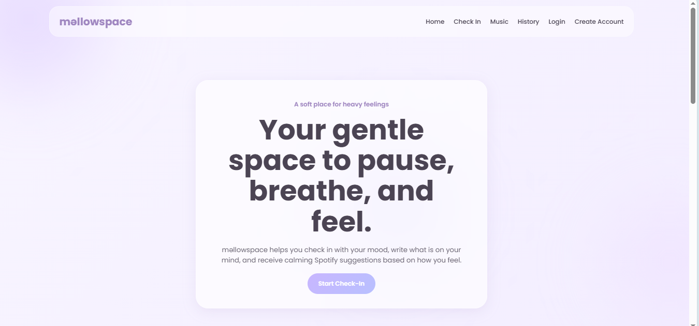

# məllowspace 🌙✨

məllowspace is a gentle mental wellness web application designed to help users pause, reflect, and express how they feel in a calm and emotionally safe environment.

The application allows users to:
- Track their moods
- Journal their thoughts
- Receive supportive prompts
- Get Spotify music recommendations based on emotions
- Create accounts and log in securely on the frontend

Built with a soft lilac glassmorphism aesthetic, floating animated blobs, and a fully responsive layout, məllowspace aims to create a soothing digital experience for emotional check-ins.

---

#  Features

##  Mood Tracking
Users can select moods such as:
- Happy
- Sad
- Anxious
- Overwhelmed
- Tired
- Angry

The application dynamically updates recommendations based on the selected mood.

---

## Emotional Journaling
Users can write journal entries describing how they feel.

The app also provides gentle writing prompts to help users continue typing when they feel overwhelmed or unsure how to express themselves.

Examples:
- “Right now, I feel...”
- “I think I need...”
- “What I wish someone knew is...”

---

## Spotify Mood Recommendations
Based on the selected mood, the application displays embedded Spotify tracks to provide comfort and emotional support.

---

##  Authentication System
The application includes:
- Create Account page
- Login page
- Frontend authentication using Local Storage

---

## Local Storage Support
The application stores:
- User accounts
- Mood check-ins
- Journal history

This allows data to persist even after refreshing the browser.

---

##  Fully Responsive Design
məllowspace is optimized for:
- Desktop
- Tablet
- Mobile devices

The application includes a responsive hamburger navigation menu for smaller screens.

---

##  Modern UI/UX
The interface includes:
- Glassmorphism effects
- Lilac and white color palette
- Floating animated blobs
- Smooth transitions and hover effects
- Soft typography and spacing

---

# Technologies Used

- HTML5
- CSS3
- JavaScript (Vanilla JS)
- Local Storage API
- Spotify Embed API
- Google Fonts

---

#  Project Structure

```txt
mellowspace/
│
├── index.html
├── login.html
├── create-account.html
├── style.css
├── script.js
├── auth.js
│
└── assets/
    ├── images/
    └── icons/
```

---

# 🚀 Getting Started

## 1. Clone the repository

```bash
git clone https://github.com/your-username/mellowspace.git
```

---

## 2. Open the project folder

```bash
cd mellowspace
```

---

## 3. Run the project

Simply open:

```txt
index.html
```

in your browser.

You can also use VS Code Live Server for a better development experience.

---

#  Authentication Notes

The current authentication system uses browser Local Storage.

This is suitable for:
- Frontend practice
- Student projects
- UI/UX demonstrations

However, it is **not secure for production applications** because passwords are stored locally in the browser.

Future improvements could include:
- Firebase Authentication
- MongoDB
- Express.js backend
- JWT authentication

---

# Future Improvements

Possible future features:
- Dark mode
- AI-generated supportive responses
- Real-time chatbot support
- Mood analytics dashboard
- Daily emotional streaks
- Password encryption
- Cloud database integration
- Voice journaling
- Meditation exercises
- Breathing animations

---

#  Objectives

The main goals of this project are:
- Encouraging emotional self-expression
- Creating a calming digital environment
- Combining wellness and technology
- Practicing responsive frontend development
- Improving JavaScript and UI/UX skills

---

#  Screenshots

Add screenshots of:
- Homepage
- Mood selection section
- Spotify recommendations
- Login page
- Create account page
- Mobile responsiveness

Example:




---

#  Contributing

Contributions, suggestions, and improvements are welcome.

To contribute:
1. Fork the repository
2. Create a new branch
3. Commit your changes
4. Push your branch
5. Open a Pull Request

---

#  License

This project is licensed under the MIT License.

---

#  Acknowledgements

- Spotify Embed API
- Google Fonts
- Inspiration from modern wellness and journaling applications

---

#  Author

Developed with care by Aisha Wanjiru.
